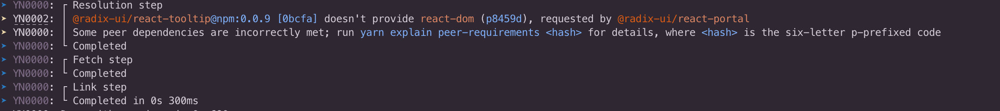
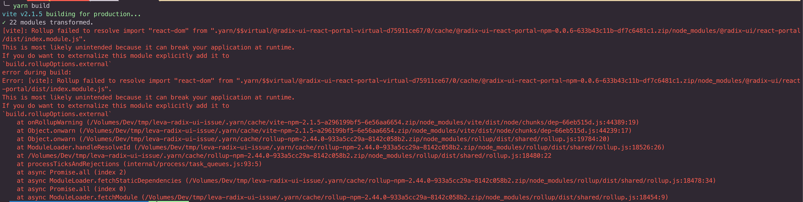

This repository reproduces an issue with [leva 0.9.x](https://github.com/pmndrs/leva) when used with `yarn pnp` and `rollup`.

# The issue

Installing or updating dependencies `yarn` prints a warning:



Creating a static bundle `rollup` fails because of the following error:




The problem is related to `leva`'s dependency to `@radix-ui/react-tooltip@0.0.9`.

The issue It's resolved upgrading to the latest to `@radix-ui/react-tooltip@0.0.16`.

# Temporary workaround

As workaround I'm forcing the sub-dependencies resolution to:

```json
  "resolutions": {
    "@radix-ui/react-tooltip": "0.0.16",
    "@radix-ui/react-portal": "0.0.9"
  }
```